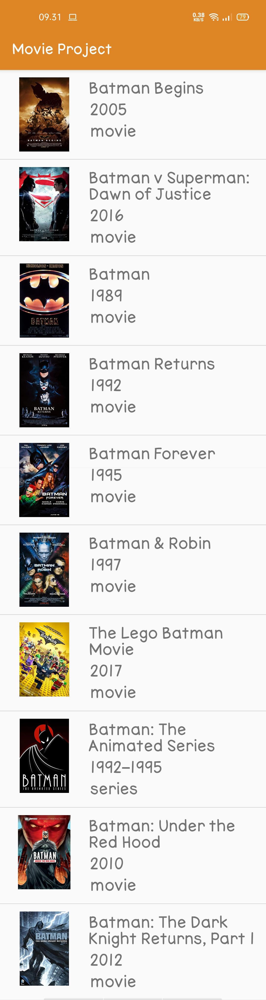
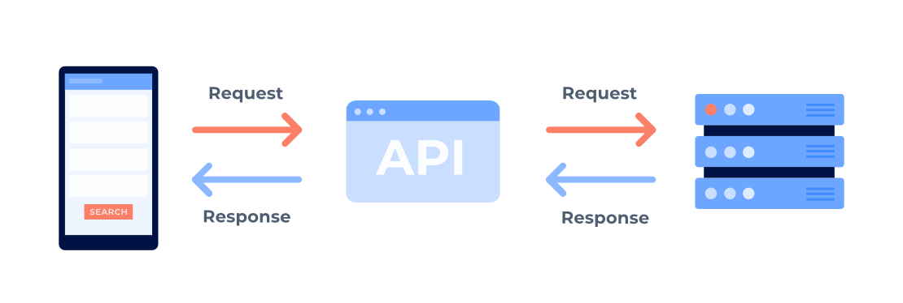

# MovieProject

- Hasil Aplikasi 

# API

API atau Application Programming Interface adalah sebuah interface yang dapat menghubungkan aplikasi satu dengan aplikasi lainnya. Jadi, API berperan sebagai perantara antar berbagai aplikasi berbeda, baik dalam satu platform yang sama atau lintas platform.

- Manfaat API

1. Memudahkan Membangun Aplikasi yang Fungsional

2. Pengembangan Aplikasi Menjadi Lebih Efisien

3. Meringankan Beban Server

- Cara kerja API 

1. Aplikasi mengakses API

2. API Melakukan Request ke Server

3. Server Memberi Respon ke API

4. API Menyampaikan Respon ke Aplikasi

Penjelasan  lengkap dapat dilihat [disini.](https://www.niagahoster.co.id/blog/api-adalah/#:~:text=API%20atau%20Application%20Programming%20Interface,yang%20sama%20atau%20lintas%20platform.)

# Rest API

REST merupakan kependekan dari Representational State Transfer. REST ini merupakan web service yang bersifat stateless, jadi setiap kali request harus menyertakan semua data dan parameter dengan lengkap. REST ini bersifat client dan server. Client REST akan meminta sesuatu ke REST server, REST server kemudian akan memberikan response, client REST ini kemudian akan menampilkan hasilnya atau melakukan pemrosesan yang lain.

Prinsip kerja dari  REST API ini adalah client akan menganggap  server sebagai object yang dapat dibuat, diupdate, dihapus dan juga dibaca. Jadi pada pelaksanaannya akan ada create dengan request POST, update dengan request PUT atau PATCH, hapus dengan request DELETE, dan baca dengan request GET.

Penjelasan lebih lengkap dapat dilihat [disini.](https://www.proweb.co.id/articles/restful/restful-api.html)

# Retrofit

Resource yang berbentuk format JSON yang disediakan REST server dapat dimanfaatkan oleh aplikasi android dengan library Retrofit. Retrofit adalah library Rest Client untuk android dan java dari squareup. hal ini membuatnya relatif mudah untuk mengambil dan mengunggah JSON (atau struktur data lainnya) melalui webservice berbasis REST. Di Retrofit Anda mengonfigurasi konverter mana yang digunakan untuk serialisasi data. Biasanya untuk JSON menggunakan GSon, tetapi juga dapat menambahkan konverter khusus untuk memproses XML atau protokol lain.

Penjelasan lebih lengkap dapat dilihat [disini.](https://polinema-mobile.github.io/jobsheet/10/00.html)

Sekian, Terimakasih:)

# Salsabilla MA / 39

